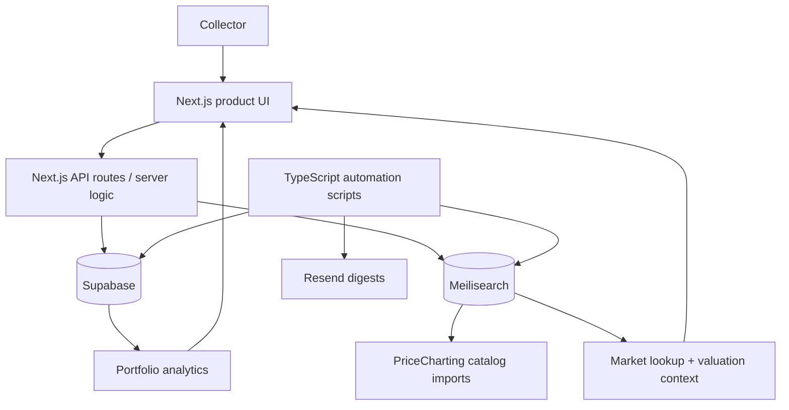

# VAULT Architecture

VAULT is structured as a full-stack collection portfolio application: a polished Next.js product surface backed by Supabase for app data, Meilisearch for catalog search, and scheduled TypeScript scripts for valuation refresh workflows.

## System map

## Core components

### Product UI

The frontend is designed like a premium portfolio dashboard rather than a generic CRUD app. It includes collection overview, asset tables, position detail pages, market state, and share/export-oriented surfaces.

### Supabase app data

Supabase stores user-owned app state: collection items, documents, profile data, and portfolio metadata. This keeps the primary database focused on user-specific records.

### Meilisearch catalog layer

Meilisearch handles collector catalog search and PriceCharting-backed market lookup. The important design choice is separation: large third-party catalogs belong in a search index, not the primary app database.

### Data and automation scripts

Scripts in `scripts/` support catalog seeding, market price syncing, image enrichment, daily refreshes, and email digest flows. This makes the product operational rather than static.

### Email/digest layer

Resend-backed scripts make collection updates and portfolio movement visible outside the app, which matters for retention and product loops.

## Failure modes considered

- Large catalog CSVs should not overload Supabase tables
- Market data can become stale without scheduled refreshes
- Search quality needs to tolerate messy collector item names
- Portfolio valuation should communicate uncertainty rather than pretending every estimate is exact
- User-facing dashboards need graceful empty/loading/error states to avoid feeling like an internal tool

## Future improvements

- Add historical portfolio snapshots
- Add valuation confidence bands and stale-data warnings
- Add import pipelines for spreadsheets and existing collections
- Add document OCR/provenance workflows
- Add CI jobs for typecheck, build, and core refresh scripts
