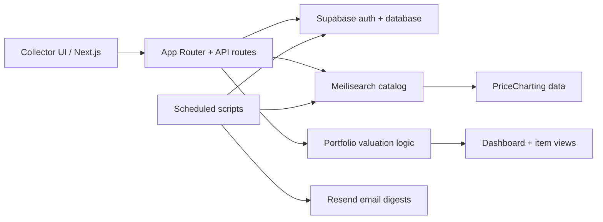

# VAULT Collection OS

Portfolio-grade collection management for tracking physical assets, value, documents, and market signals.

VAULT is a full-stack product experiment for collectors who want their physical assets to feel as trackable as a financial portfolio: positions, categories, liquidity, documents, estimated value, and market movement in one polished dashboard.

<p align="center">
  <a href="https://vaultcollection.org">Live product</a>
</p>

## Why it matters

Most collectors manage valuable physical assets through spreadsheets, camera rolls, marketplace screenshots, and memory. VAULT turns that into a structured product surface: every item has metadata, valuation context, documentation, and portfolio-level analytics.

This repo is meant to show product engineering range: frontend taste, backend workflows, data syncing, scheduled jobs, search infrastructure, and a clean full-stack architecture.

## Key features

- Portfolio dashboard with total value, item counts, category performance, and collection-level signals
- Asset collection table with category filters, search, sort, valuation data, document coverage, and liquidity state
- Position detail pages for individual items, including value, return, market liquidity, and sale history
- Supabase-backed data model for users, items, documents, and portfolio state
- Meilisearch catalog layer for fast market lookup and PriceCharting-backed collector data
- Scheduled refresh/email scripts for daily market updates and digest workflows
- Share-card/export oriented polish for making collection milestones visible and viral

## Technical architecture



## Tech stack

| Layer | Tools |
| --- | --- |
| Frontend | Next.js, React, TypeScript, Tailwind, Framer Motion, Recharts |
| Backend | Next.js API routes, Supabase client/server flows |
| Data | Supabase, Meilisearch, PriceCharting catalog imports |
| Automation | TypeScript scripts, scheduled refresh jobs, email digest scripts |
| Infra | Railway config, GitHub Actions-ready scripts, `.env.example` |

## My ownership

- Designed and built the product concept, UI system, collection dashboard, and detail pages
- Implemented portfolio value surfaces, category-level analytics, market lookup flows, and daily refresh scripts
- Integrated Supabase for app data and Meilisearch for fast catalog search instead of storing large catalog CSVs directly in the primary database
- Built operational scripts for catalog seeding, price syncing, image enrichment, daily refreshes, and email digests
- Treated the product as a real startup-style dashboard rather than a static demo

## Technical decisions

- **Meilisearch for catalog search:** collector catalogs can be large and search-heavy, so market lookup belongs in a search index instead of bloating the primary app database.
- **Supabase for app state:** user-owned collection data, documents, and portfolio state need relational structure, auth compatibility, and fast iteration.
- **Scripted data refreshes:** valuation data changes over time, so refresh jobs and digest scripts make the system feel alive beyond the UI.
- **Polished product UI:** the goal is not only CRUD; the interface should make physical collections feel premium, legible, and worth managing.

## Local setup

```bash
git clone https://github.com/Khas-Erdene-Tsogtsaikhan/vault-portfolio.git
cd vault-portfolio
npm install
cp .env.example .env.local
npm run dev
```

Useful checks:

```bash
npm run lint
npm run typecheck
npm run build
```

Data scripts:

```bash
npm run seed:catalog
npm run sync:catalog
npm run refresh:daily
npm run email:test
```

## Environment variables

See [`.env.example`](./.env.example). The main services are:

- Supabase for app auth/data
- Meilisearch for catalog search
- PriceCharting for collector valuation data
- Resend for transactional/digest email

## Results / proof

- Live product: [vaultcollection.org](https://vaultcollection.org)
- Built as a startup-grade full-stack product surface, not a toy CRUD dashboard
- Demonstrates product design, data workflows, scheduled jobs, search infrastructure, and full-stack delivery

## What I would improve next

- Add a formal eval/test dataset for valuation accuracy and stale-price detection
- Add snapshot-based portfolio history so users can inspect value movement over time
- Add import flows for CSV/spreadsheet collections
- Add stronger document OCR and authenticity workflows for receipts, appraisals, and provenance
- Add CI coverage around refresh scripts and API routes
